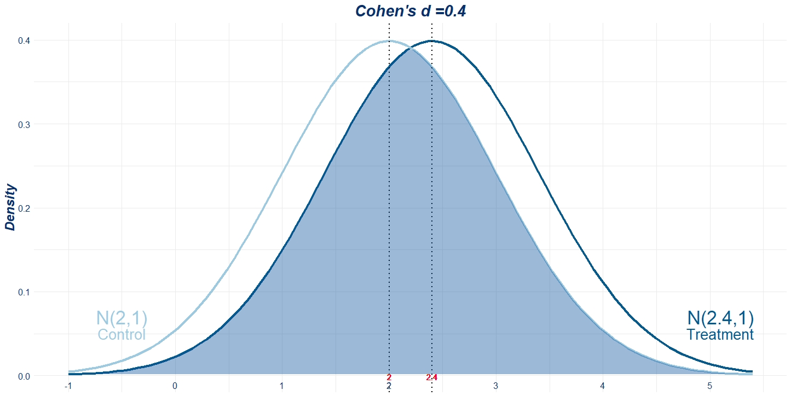
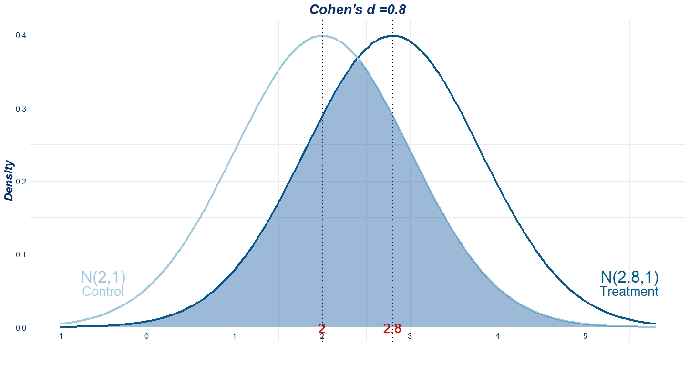
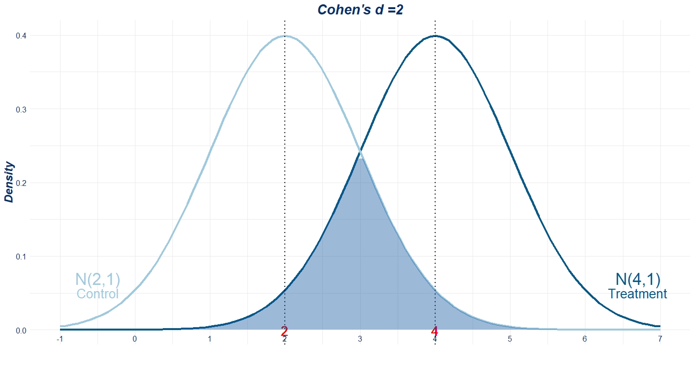

SMD Illustration
---------------

``` r
library(ggplot2)
```

    ## Warning: package 'ggplot2' was built under R version 3.5.3

``` r
smd_norm <- function(d= 2, m_control=2){
  sd = 1
  m_treatment <- d*sd + m_control
  x <- seq(m_control -3*1, m_treatment + 3*1, length.out = 100)
  dt_control <- data.frame(group = "control",x = x, y= dnorm(x,m_control,sd))
  dt_treatment <- data.frame(group = "treatment",x = x, y = dnorm(x,m_treatment,sd))
  dt <- rbind(dt_treatment,dt_control)
  overlap <- data.frame(x = x, y = pmin(dt_control$y, dt_treatment$y))
       ggplot(dt, aes(x,y, color=group)) +
       geom_line(size=1.5)+
       geom_vline(xintercept = m_control, linetype="dotted",size=1) + 
       geom_text(x= m_control, y = -0.001,size=7, label = m_control, color = "red") + 
       geom_vline(xintercept = m_treatment, linetype="dotted",size=1)+ 
       geom_text(x= m_treatment, y = -0.001,size=7, label = m_treatment, color = "red") + 
       geom_polygon(aes(color=NULL),data=overlap, fill="#08519c", alpha= 0.4)+
       scale_colour_manual(values = c("#045a8d","#9ecae1"))+
       scale_x_continuous(name = "", breaks = seq(m_control -3*1, m_treatment + 3*1, sd))+
       scale_y_continuous(name = "Density", limits = c(0, 0.4))+
       annotate("text",x = c(m_control-2.5,m_treatment + 2.7),y = c(0.07,0.07), label = c(paste0("N(",m_control,",1)", sep=""),paste0("N(",m_treatment,",1)", sep="")),
                color = c("#9ecae1","#045a8d"), size =9) +
       annotate("text",x = c(m_control-2.5,m_treatment + 2.7),y = c(0.05,0.05), label = c("Control","Treatment"),
                  color = c("#9ecae1","#045a8d"), size =7) +
       theme_minimal()+labs(title= paste0("Cohen's d =",d,sep=""))+
       theme(axis.text.x=element_text(color = "#08306b",size = 12,vjust=10),
          axis.text.y=element_text(color = "#08306b",size = 12),
          axis.title.y=element_text(color = "#08306b",size = 18, face = "bold.italic"),
          plot.title = element_text(color = "#08306b", size = 22, face = "bold.italic",hjust = 0.5),
          legend.position="none")
}


p1 <- smd_norm(0.2,2)
p2 <- smd_norm(0.4,2)
p3 <- smd_norm(0.8,2)
p4 <- smd_norm(2,2)
p <- list(p1, p2, p3,p4)

library(gridExtra)
n <- length(p)
do.call("grid.arrange", c(p, ncol=2))
```


### Cohen's d = 0.4



### Cohen's d = 0.8



### Cohen's d = 2


